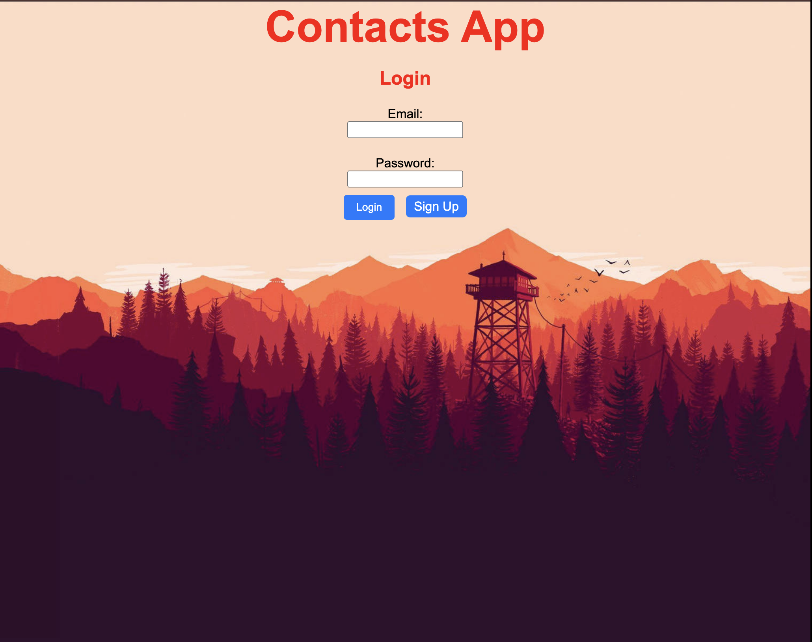
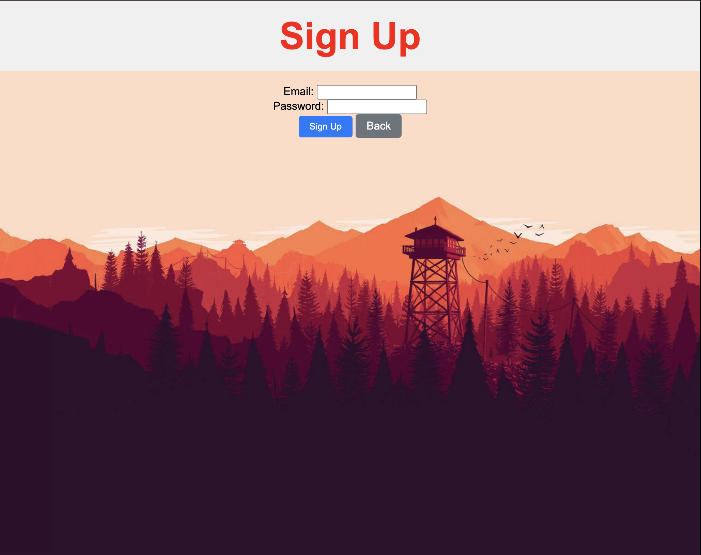
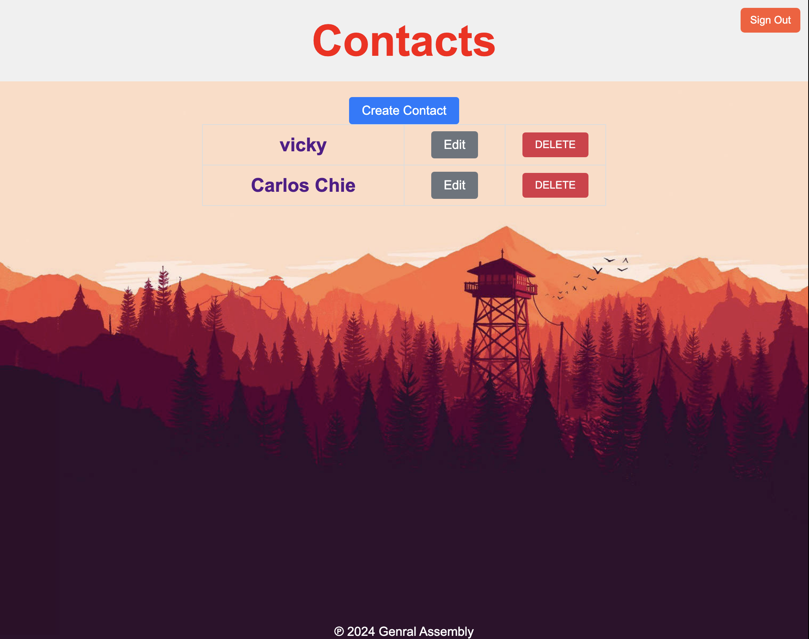
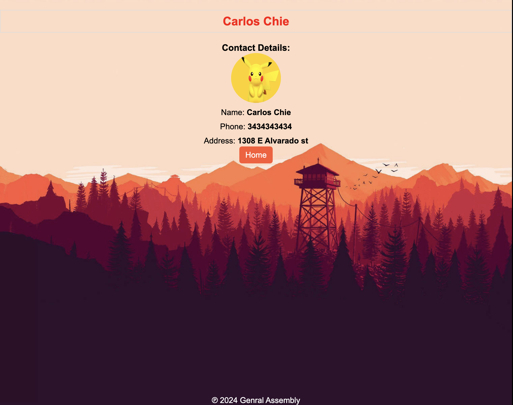
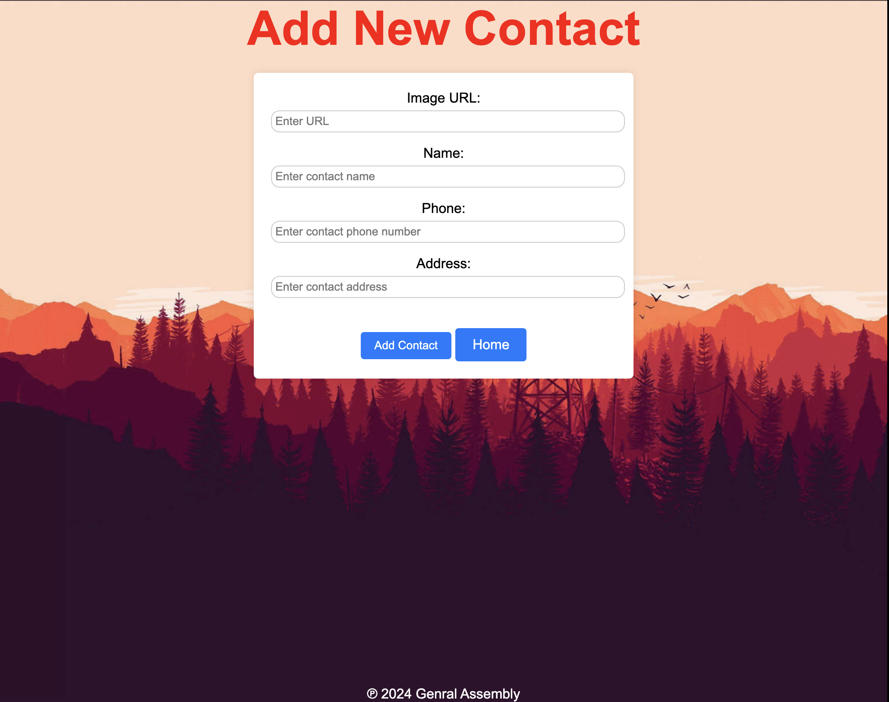

#  Contact List Finder
 ---
## Contact List
The Contact List finder is designed to help users organize and manage their contacts efficiently. It provides a user-friendly interface for adding, editing, searching, and deleting contacts.

---
## MVP Goals

- User Authentication and Authorization
- Contact Management
- Search Functionality
- Deployment
- User Feedback

---
## Built with
-  Node/Express/MongoDB app 
---
## Getting Started
- Method 1: Down here is the link to my Project2 App and all you have to do is click the link!
https://project-2-website-c80aceee2d9e.herokuapp.com/sessions/new
- Method 2: Fork and Clone this to your own account and to your machine. 
-  Open up with vscode and use nodemon on your terminal to open up

 ---
## Next Steps
- Contact Import/Export
- Data Backup and Recovery
- Mobile Application Development
- Adding a search bar in order to search for the contact
- Adding emergency contacts

